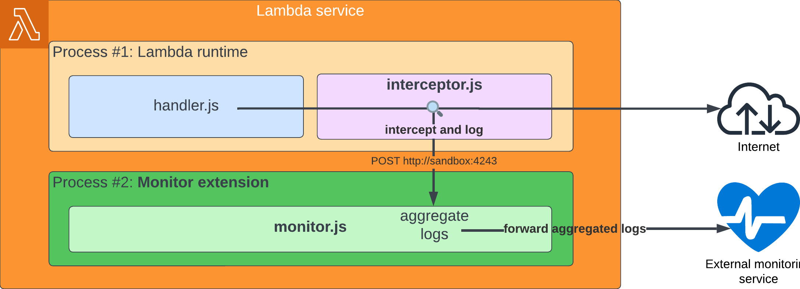

# Lambda extensions example

Code of the article [Power up your serverless application with AWS Lambda extensions](https://dev.to/kumo/power-up-your-serverless-application-with-aws-lambda-extensions-3a31)

This example shows how to create a simple Lambda with a monitoring tool composed of:
- an internal extension that logs all http calls made by the Lambda
- an external extension that aggregate those logs and send them to an hypothetical monitoring tool



## Install

Change the `https://webhook.site/*` urls in `src/urls.ts` to your own webhook urls.

```bash
 pnpm install
 pnpm cdk bootstrap
 pnpm run deploy
```

## Test

```bash
pnpm integration-test
```
